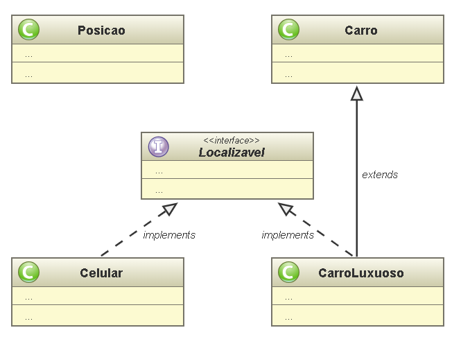

# Interfaces, Encapsulamento
### Descrição

Neste trabalho, você implementará as classes ao lado
necessárias para representar alguns objetos em um
Sistema de Informação Geográfica (GIS - Geographic
Information System). Nestes sistemas, alguns objetos são
passíveis de se localizarem (usando GPS, localização WiFi).
Tais objetos são instâncias de classes que implementam a
interface Localizavel.

### Objetivo

- Implementação de classes e interfaces em Java usando
os conceitos de encapsulamento.

