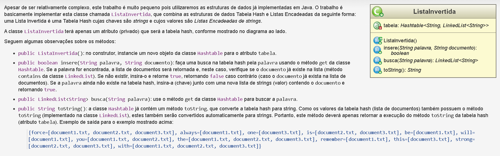

# Lista Invertida
### Introdução

Muitos sistemas de busca (e.g., Google, Yahoo) usam técnicas de Recuperação de Informação para a indexação e busca rápida em uma base grande de dados (e.g., a Internet). Uma das técnicas mais usadas é a Lista Invertida (ou Índice Invertido).
Em uma lista invertida, as palavras dos documentos (e.g., casa, carro, etc) são indexadas em uma tabela hash e cada item (cada palavra) possui uma lista indicando em quais documentos ela ocorre

### Objetivo

- Implementar em Java uma lista invertida, que nada mais é do que uma tabela hash (classe Hashtable do Java) em que a chave da tabela será uma string (palavra) e em que o valor da tabela será uma lista encadeada de strings (lista de documentos). Para a lista encadeada, será usada a classe LinkedList do Java.

